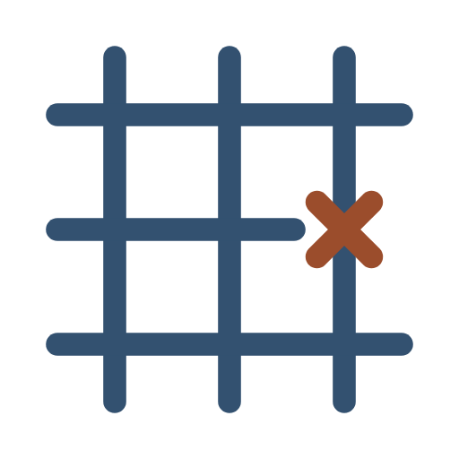

<p align="center">
  <a href="https://github.com/ecoma-io/lattice/actions/workflows/ci.yml"></a>
  <a href="https://github.com/ecoma-io/lattice/actions/workflows/analysis.yml"></a>
  <a href="https://scorecard.dev/viewer/?uri=github.com/ecoma-io/lattice"></a>
  <a href="LICENSE"></a>
  = 24" />
  
  
  <a href="CONTRIBUTING.md"></a>
</p>

<p align="center">
  
</p>

<h1 align="center">Lattice</h1>

<p align="center">
  <strong>Module boundaries for the languages ESLint cannot read.</strong><br />
  Nx sees the dependency graph of a TypeScript workspace and enforces its architecture.
  Add Go, Rust or Python and both halves go quiet — not wrong, quiet.
  Lattice is what makes them speak again.<br />
  <em>A rule that reports nothing looks exactly like a rule with nothing to report.</em>
</p>

<p align="center">
  <a href="docs/usage/getting-started.md"><strong>Get&nbsp;started&nbsp;→</strong></a> ·
  <a href="docs/why.md">Why&nbsp;it&nbsp;exists</a> ·
  <a href="docs/north-star.md">Where&nbsp;it&nbsp;is&nbsp;going</a> ·
  <a href="docs/roadmap.md">Roadmap</a> ·
  <a href="https://ecoma.io">About&nbsp;Ecoma</a>
</p>

---

## Install

```bash
pnpm add -D @ecoma-io/lattice
```

Register it in `nx.json` and it starts adding the missing edges:

```json
{
  "plugins": ["@ecoma-io/lattice/nx"]
}
```

Then check the boundaries those edges cross:

```bash
pnpm exec lattice check
```

```text
✔ no boundary violations (264 imports in 78 files across 12 projects)
```

Ten minutes end to end, most of it spent deciding what your tags mean:
[**Getting started →**](docs/usage/getting-started.md)

## The idea in one picture

The name is the architecture. A lattice's bars do two things at once, and which
one you see depends on what you are: **structure** if you are being held,
**barrier** if you are trying to cross.

- **The bars are the dependency edges.** Real ones, read out of each language's
  own manifests — `go.mod`, `Cargo.toml`, `pyproject.toml` — so the graph
  matches what the compiler will actually do.
- **The crossings are where two projects meet.** Most should connect. That is
  what a shared library is for.
- **One crossing is refused.** The mark's red X is a boundary violation: an edge
  the tags say must not exist. Finding those, in files no ESLint rule can parse,
  is the whole job.

## Why it exists

`nx affected` under-selects and `@nx/enforce-module-boundaries` never sees the
file — so a Go project's `layer:` and `scope:` tags are a declaration with no
mechanism behind them. Neither failure announces itself.

That claim was measured rather than assumed, and the measurement is in
[**docs/why.md**](docs/why.md), along with why an ESLint parser and an
inferred-target plugin were both the wrong answer.

## What is here

| Package                                                   |                                                                                                                                                                                                                         |
| --------------------------------------------------------- | ----------------------------------------------------------------------------------------------------------------------------------------------------------------------------------------------------------------------- |
| [**`@ecoma-io/lattice`**](packages/lattice/README.md)     | Reads Go, Rust and Python manifests into the Nx project graph, then judges imports against tag-based boundary rules — the `@nx/enforce-module-boundaries` contract, for the languages it cannot reach.                  |
| [**`lattice-vscode`**](packages/lattice-vscode/README.md) | The VS Code client for that server: the same verdicts, at the edit. It runs the server your workspace installed rather than one of its own, so the buffer and the pipeline cannot disagree. Not on the marketplace yet. |

Fifteen violation types, eight options, and the same `messageId`s ESLint reports
— so the two enforcers can be compared rather than merely both being red. Five
languages today; [more is the direction](docs/north-star.md).

## The one commitment behind all of it

**An empty result is a claim, not a shrug.**

An empty diagnostic list means "no violation" and nothing else. Every path that
cannot reach a verdict says so instead of returning quietly — which is why the
CLI has an exit code for _could not look_ that is distinct from _looked and found
nothing_, and why the issue tracker has a
[dedicated form for a missed violation](.github/ISSUE_TEMPLATE/missed_violation.yml)
separate from the ordinary bug form.

A tool that replaced a known gap with an unknown one, wearing a green checkmark,
would be worse than the silence it replaced. The rest of the reasoning, and the
refusals that follow from it, are in [**docs/north-star.md**](docs/north-star.md).

## Documentation

|                                                                                                                                                        |                                                                          |
| ------------------------------------------------------------------------------------------------------------------------------------------------------ | ------------------------------------------------------------------------ |
| [**Getting started**](docs/usage/getting-started.md)                                                                                                   | Install, configure, first violation                                      |
| [Designing boundaries](docs/usage/designing-boundaries.md)                                                                                             | The constraint table, and the five semantics that surprise people        |
| [The fifteen violations](docs/usage/violations.md)                                                                                                     | What each `messageId` means, and what fixes it                           |
| [What each language sees](docs/usage/languages.md)                                                                                                     | Per-language coverage and every declared parse limit                     |
| [CI](docs/usage/ci.md) · [Editors](docs/usage/editors.md) · [Troubleshooting](docs/usage/troubleshooting.md)                                           | Exit codes, SARIF, LSP setup, and what to check when it reported nothing |
| [Architecture](docs/development/architecture.md) · [Adding a language](docs/development/adding-a-language.md) · [Testing](docs/development/testing.md) | For contributors                                                         |

Full index: [**docs/**](docs/README.md). The package's own reference, which
stands alone as the npm landing page, is
[here](packages/lattice/README.md).

## Built for Ecoma — a labor operating system for humans and AI agents

Lattice was extracted from the working practice of [**Ecoma**](https://ecoma.io),
the self-hostable, fair-code **labor operating system** where people, AI agents
and rules are the same kind of resource: a role, and whoever fills it.

That premise puts unusual weight on a dependency graph. When an agent proposes a
change, the question "what does this reach?" is asked by a machine, at a rate no
reviewer can match — and an architectural boundary that only exists inside one
language's linter is a boundary the agent will cross without ever seeing a
warning. The rules here are the ones that survived contact with that problem.

You do not need Ecoma to use them. Nothing in this repository depends on it.

## Contributing

The most valuable contribution here is a **missed violation** — an import that
crosses a boundary in a real workspace and produced no output. That is a bug of
the worst kind this project has, and it earns a permanent regression fixture,
not just a fix.

Setup, commands, commit format and how a pull request lands:
[CONTRIBUTING.md](CONTRIBUTING.md). How the thing works inside:
[docs/development/](docs/development/architecture.md). By participating you agree
to the [Code of Conduct](CODE_OF_CONDUCT.md). Security reports go through
[SECURITY.md](SECURITY.md), never a public issue.

## License

[Apache License 2.0](LICENSE) — © Mai Ngọc Hóa (John Martin) and the Lattice
contributors.

Apache-2.0 rather than MIT because it carries an explicit patent grant. For
tooling that ends up embedded in commercial build pipelines, that is the
difference between "probably fine" and "written down".

---

<p align="center">
  <br />
  <sub>
    Part of the <a href="https://ecoma.io">Ecoma</a> ecosystem ·
    <a href="https://ecoma.io">Website</a> ·
    <a href="https://github.com/ecoma-io">Organisation</a>
  </sub>
</p>
