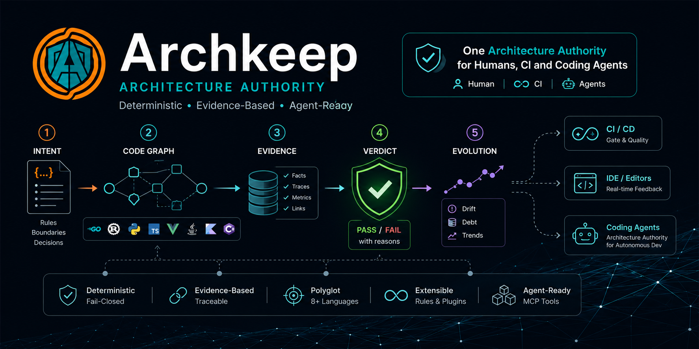

<p align="center">
  
</p>

<h1 align="center">Lattice</h1>

<p align="center">
  <strong>A deterministic architecture governance system for humans and coding agents.</strong><br />
  Observed architecture is compared against declared intent and enforced as a verdict —
  not a reviewer's belief. Polyglot module boundaries, deterministic evidence,
  drift detection, evolution history and agent planning context, in any repository,
  with or without Nx or Moon.<br />
  <em>A rule that reports nothing looks exactly like a rule with nothing to report.</em>
</p>

<p align="center">
  <a href="https://github.com/ecoma-io/lattice/actions/workflows/ci.yml"></a>
  <a href="https://github.com/ecoma-io/lattice/actions/workflows/analysis.yml"></a>
  <a href="https://scorecard.dev/viewer/?uri=github.com/ecoma-io/lattice"></a>
  <a href="LICENSE"></a>
</p>

<p align="center">
  <a href="docs/getting-started/installation.md"><strong>Quick&nbsp;start&nbsp;→</strong></a> ·
  <a href="docs/why.md">Why&nbsp;it&nbsp;exists</a> ·
  <a href="docs/doctrine/architecture-authority.md">What&nbsp;it&nbsp;governs</a> ·
  <a href="docs/doctrine/north-star.md">North&nbsp;star</a> ·
  <a href="docs/roadmap.md">Roadmap</a> ·
  <a href="https://ecoma.io">About&nbsp;Ecoma</a>
</p>

---

## What Lattice is

Lattice is a **deterministic architecture governance system** built for two
consumers at once: a human team reviewing its architecture like code, and a
coding agent that needs the same facts, machine-readably, at the moment it
touches a boundary.

The core loop is a comparison, not an opinion:

```
Observed architecture            the project graph Lattice derives from source
        ↓
Architecture model               projects, edges, tags — from Nx, Moon, or the native provider
        ↓
Intent / policy                  the constraint table in your workspace + the declared
                                 architecture-intent.json
        ↓
Governance                       the verdict — deterministic, fail-closed, as an exit code
        ↓
Evidence                         explain · impact · provenance · snapshots
        ↓
Evolution                        diff across one change · history across snapshots
        ↓
Agent context                    the deterministic facts an agent needs before editing
        ↓
Verification                     check · drift, after the change
```

Every step is a pure function of the workspace's own bytes. Lattice reports what
it found and what it inspected; it never reasons, guesses, or generates a law.
The same analysis serves three faces — the CLI, the language server, and the
integrations — and the verdict is the same in each, so `check` in CI and a
diagnostic in an editor and a JSON envelope read by an agent can never disagree.

## Why it exists

Agentic coding increases the rate at which architectural decisions are made.
Humans cannot manually review every architectural decision — an agent can
create or cross a project boundary minutes after a design conversation ended.
Architecture cannot rely on human memory and human review alone. It has to be
explicit, machine-readable, continuously checked, and available to the agents
that are changing the code.

Lattice closes the gap where the existing toolchain goes quiet. In a polyglot
repository, the languages ESLint cannot parse have `layer:`, `scope:` and
`license:` tags with no mechanism behind them — a Go import that crosses a
boundary passes lint because ESLint answers "File ignored because no matching
configuration was supplied" for `.go`, and `nx affected` is blind to a Cargo
path dependency or a `pyproject.toml` path dependency. Silence is the problem:
an under-selecting `affected` and an absent boundary rule look exactly like a
clean workspace. The measurement that established this is in
[**docs/why.md**](docs/why.md).

## Core capabilities

```
Repository
    ↓
Architecture model          projects, edges, tags — from a provider (Nx, Moon, or native)
    ↓
Policy / intent             the constraint table in your workspace
    ↓
Deterministic evidence      graph · check · diff · drift · history · health · impact · explain · context · snapshots
    ↓
Governance                  the verdict, as an exit code and a machine-readable report
    ↓
Human + coding agent        a developer in CI, an agent reading the JSON envelope
```

One analysis, three faces: the CLI, the language server, and the integrations. The verdict is
the same everywhere; only the delivery changes. Fifteen commands —
`check`, `graph`, `diff`, `discover`, `drift`, `reconcile`, `waivers`, `fitness`,
`history`, `health`, `debt`, `impact`, `explain`, `context`, `provenance` —
with versioned machine-readable
output, four exit codes, and a snapshot/diff pair that records the architecture over time
with provenance. The full pipeline is in [**docs/concepts/architecture.md**](docs/concepts/architecture.md).
Each capability below is real, implemented behaviour — see
[**docs/reference/cli.md**](docs/reference/cli.md) for every command, flag and
exit code, and [**docs/concepts/**](docs/concepts/architecture.md) for the model.

- **Architecture graph** — a deterministic snapshot of the project graph from
  any provider: the projects, the edges that connect them, and the fact that a
  `.vue` file shares a project with a `.ts` file. `graph` prints it;
  `diff` compares two snapshots edge by edge.
- **Architecture Intent** — `architecture-intent.json` at the workspace root
  declares what the architecture _is_ (boundaries), what it must not do and must
  build (`forbidden` / `allowed` relationships), and what projects and
  dependencies may exist. It is _optional_ and _non-authoritative on its own_:
  intent is a human declaration, and Lattice judges the observed architecture
  against it — it never decides what the architecture should be.
  [**docs/reference/architecture-intent.md**](docs/reference/architecture-intent.md)
- **Policy** — the boundary law: one constraint table in the workspace, in the
  shape `@nx/enforce-module-boundaries` already takes, extended to every
  supported language. [**docs/reference/policy-schema.md**](docs/reference/policy-schema.md)
- **Check** — the authoritative governance gate. `check` judges every import
  site against the boundary law **and** folds the intent comparison in by
  presence. Four exit codes: 0 clean, 1 findings, 2 usage error, 3 could not
  look — and 3 is never clean. Suppression is a tracked decision, never a
  silent one: `coverage.exempt` in `lattice.json` suppresses permanently and
  requires a **mandatory** reason — a waiver with no reason is
  indistinguishable from coverage that quietly stopped being enforced.
  [**docs/reference/exit-codes.md**](docs/reference/exit-codes.md)
- **Machine-readable output** — `--format json` wraps any verdict in a versioned
  envelope (`schemaVersion`, `status`, `exitCode`, coverage): every field name
  and version are a public contract from this release on, and two runs over an
  unchanged tree produce byte-identical JSON — never parse prose.
  [**docs/reference/json-output.md**](docs/reference/json-output.md)
- **Drift** — what already diverged, surfaced four ways: boundary violations and
  configuration drift through `check`, structural drift through `diff`, and
  intent drift through `drift` (and inside `check` when an intent file exists).
  [**docs/concepts/drift.md**](docs/concepts/drift.md)
- **Evolution** — `diff` answers _what changed_ across one change; `history`
  answers _how did it evolve_ across a directory of snapshots, classifying each
  transition as architecture, policy/intent, provider, or code drift — by
  evidence the snapshots carry, never by inference.
  [**docs/usage/diff.md**](docs/usage/diff.md) ·
  [**docs/usage/history.md**](docs/usage/history.md)
- **Impact** — which projects transitively depend on a project, separated into
  direct and transitive. An empty dependents list is a claim ("nothing depends
  on this"), not a shrug.
- **Explain** — the full judgment for one import site: which constraint row
  matched, which tags applied, whether it is a violation and why.
- **Provenance** — every snapshot carries the git origin of the run; `history`
  discloses provenance advancing while nothing architectural changed as _code
  drift_. Evidence is attributable, never anonymous.
- **Waivers** — a boundary violation accepted for a **fixed term**:
  `waivers` lists term-bound suppressions, and `check` keeps reporting a
  waived violation as a finding (exit 1) so CI still catches the day it
  lapses. A waiver never promotes `unknown` → `pass`.
  [**docs/concepts/waivers.md**](docs/concepts/waivers.md)
- **Fitness** — named quality gates the workspace holds itself to (the graph
  stays cycle-free, no layer reaches the domain, the suppression count stays
  below a threshold), each judged once per run with a `pass` / `fail` /
  `unknown` / `not_applicable` verdict.
  [**docs/usage/fitness.md**](docs/usage/fitness.md)
- **Health** — per-metric verdicts over the workspace's own record, never a
  synthesized number: a metric whose evidence is unavailable is `unknown` or
  `not_applicable`, never zero. [**docs/concepts/health.md**](docs/concepts/health.md)
- **Debt** — ages waivers, gaps and drift across a directory of snapshots:
  how long a violation has been accepted or unknown, not another live check.
  [**docs/reference/debt.md**](docs/reference/debt.md)
- **Reconcile** — the inverse comparison to `drift`: scores every observed
  project, edge, tag, and intent row against the declared model, and — only
  under `--propose` — derives the edits that would make them agree, marked as
  proposals that are never written. [**docs/concepts/reconciliation.md**](docs/concepts/reconciliation.md)
- **Discover** — the read-only face of "the architecture is already there":
  reports what is observed (projects, edges, tags, coverage), and under
  `--propose` derives candidate components and boundary assertions — also
  proposal-only, never written. [**docs/reference/discovery.md**](docs/reference/discovery.md)
- **Agent context** — `context <project>` shows the constraints that apply
  before an edit; `context <project> --plan` bundles the current architecture
  snapshot, the applicable policy with the author's intent, the impact of a
  change, the current violations, drift, coverage, and the verification commands
  — the deterministic facts an agent plans over. Facts, not a plan.
  [**docs/usage/context.md**](docs/usage/context.md)

## Determinism, evidence, and fail-closed

Three properties run through everything above, and the docs call them by name
([**docs/doctrine/architecture-authority.md**](docs/doctrine/architecture-authority.md)):

- **Deterministic** — same workspace, same config, same tree, same answer. No
  machine-specific toolchain result, no model in the loop, no reviewer's belief.
  Two runs over an unchanged tree produce byte-identical JSON.
- **Evidence-based** — every verdict names what it inspected alongside what it
  found; every architectural fact can be traced to a file, an edge, or a
  snapshot with provenance.
- **Fail-closed** — a path that cannot reach a verdict says so instead of
  returning empty. Exit 3 exists and is distinct from exit 0 for exactly this
  reason. _An empty diagnostic list means "no violation" and nothing else._

## Humans and agents

A human team uses Lattice the way it used to use a reviewer: by deciding the
architecture in code, checking it before merge, and reading evidence when a
finding appears. A coding agent uses the same authority through the `arch-*`
skills — it reads the facts, changes the code, and gets verified by the same
gate. The difference is delivery, not authority: **the agent is a consumer of
the verdict, never its authority.** A skill teaches an agent _when_ to ask and
_what to do_ with the answer; it never edits the laws the verdict is drawn from.

Four `arch-*` skills implement the agent workflow — context before the change,
an architecture-aware change, an authoritative check, and an evidence-backed
review:

| Skill          | When                                           |
| -------------- | ---------------------------------------------- |
| `arch-context` | Before editing — what may this project reach?  |
| `arch-change`  | During a change — make it architecture-aware   |
| `arch-check`   | After a change — is the gate green?            |
| `arch-review`  | Reviewing a change or PR — what is the impact? |

[**docs/skills/overview.md**](docs/skills/overview.md) documents the protocol;
the skills themselves are the protocol, installed into any Agent
Skills-compatible host.

## Supported environments

**Languages** — Go, Rust, Python, TypeScript and JavaScript, and Vue. Analysis
is from source, never from a build; nothing invokes `go`, `cargo`, `uv` or
`tsc` to answer a question about imports.
[**docs/reference/languages.md**](docs/reference/languages.md)

**Workspaces** — any repository, with three providers for the project graph:

- **Native / polyrepo** — create a `lattice.json` at the root and Lattice
  discovers projects from the tracked tree. No `nx`, no `moon`, no build system
  required.
- **Nx** — register the integration in `nx.json` and it reuses the project graph
  Nx already computes, drawing the Go/Rust/Python edges `nx affected` was
  missing.
- **Moon** — read the project graph back from `moon project-graph`, with the same
  verdict.

**Agents** — Claude Code, Codex, and opencode all run the skills and the editor
gates; the skills themselves are host-independent. See
[**docs/skills/supported-hosts.md**](docs/skills/supported-hosts.md).

## Quick start

```bash
npm install -D @ecoma-io/lattice   # or pnpm / yarn / bun
```

Create a `lattice.json` at the repository root:

```json
{
  "projects": {
    "declared": [
      { "name": "billing-core", "root": "libs/billing/core" },
      { "name": "billing-api", "root": "libs/billing/api" }
    ]
  }
}
```

Inspect what a project may reach, then check the boundaries:

```bash
lattice context billing-core --plan
lattice check
```

Declare the intended architecture (optional, but it is what makes drift and
`architecture-intent` governance real):

```json
{
  "version": "1",
  "boundaries": [{ "name": "billing", "match": ["tag:scope:billing"] }],
  "forbidden": [
    {
      "from": "billing",
      "to": "tag:scope:checkout",
      "reason": "billing must never reach into checkout"
    }
  ]
}
```

Wire `lattice check` into CI (fail on both 1 and 3 — the distinction is the
point), and hand the workflow to an agent through the `arch-*` skills.

Ten minutes end to end, most of it spent deciding what your tags mean:
[**Getting started →**](docs/getting-started/installation.md)

## The one commitment behind all of it

**An empty result is a claim, not a shrug.**

An empty diagnostic list means "no violation" and nothing else. Every path that
cannot reach a verdict says so instead of returning quietly — which is why the
CLI has an exit code for _could not look_ that is distinct from _looked and
found nothing_, and why the issue tracker has a
[dedicated form for a missed violation](.github/ISSUE_TEMPLATE/missed_violation.yml)
separate from the ordinary bug form. A tool that replaced a known gap with an
unknown one, wearing a green checkmark, would be worse than the silence it
replaced. The rest of the reasoning, and the refusals that follow from it, are
in [**docs/doctrine/north-star.md**](docs/doctrine/north-star.md).

## Documentation

|                                                                                                                                                        |                                                                                                                                                                                        |
| ------------------------------------------------------------------------------------------------------------------------------------------------------ | -------------------------------------------------------------------------------------------------------------------------------------------------------------------------------------- |
| [**Getting started**](docs/getting-started/installation.md)                                                                                            | Install, configure, first violation                                                                                                                                                    |
| [**North star**](docs/doctrine/north-star.md) · [**Roadmap**](docs/roadmap.md)                                                                         | The direction, and the staged path (1.x governance → 2.x intelligence)                                                                                                                 |
| [Designing boundaries](docs/concepts/boundaries.md)                                                                                                    | The constraint table, and the five semantics that surprise people                                                                                                                      |
| [The fifteen violations](docs/reference/violations.md)                                                                                                 | What each `messageId` means, and what fixes it                                                                                                                                         |
| [What each language sees](docs/reference/languages.md)                                                                                                 | Per-language coverage and every declared parse limit                                                                                                                                   |
| [Commands](docs/reference/cli.md)                                                                                                                      | All fifteen: `check` · `graph` · `diff` · `discover` · `drift` · `reconcile` · `waivers` · `fitness` · `history` · `health` · `debt` · `impact` · `explain` · `context` · `provenance` |
| [CI](docs/usage/ci.md) · [VS Code](docs/integrations/vscode.md) · [Troubleshooting](docs/usage/troubleshooting.md)                                     | Exit codes, SARIF, LSP setup, and what to check when it reported nothing                                                                                                               |
| [Agent skills](docs/skills/overview.md)                                                                                                                | Architecture-aware agent protocol: four `arch-*` skills                                                                                                                                |
| [Architecture](docs/development/architecture.md) · [Adding a language](docs/development/adding-a-language.md) · [Testing](docs/development/testing.md) | For contributors                                                                                                                                                                       |

Full index: [**docs/**](docs/README.md). The package's own reference, which stands
alone as the npm landing page, is [here](packages/lattice/README.md).

## Contributing

The most valuable contribution here is a **missed violation** — an import that
crosses a boundary in a real workspace and produced no output. That is a bug of
the worst kind this project has, and it earns a permanent regression fixture,
not just a fix.

Setup, commands, commit format and how a pull request lands:
[CONTRIBUTING.md](CONTRIBUTING.md). How the thing works inside:
[docs/development/](docs/development/architecture.md). By participating you agree
to the [Code of Conduct](CODE_OF_CONDUCT.md). Security reports go through
[SECURITY.md](SECURITY.md), never a public issue.

## License

[Apache License 2.0](LICENSE) — © Mai Ngọc Hóa (John Martin) and the Lattice
contributors.

Apache-2.0 rather than MIT because it carries an explicit patent grant. For
tooling that ends up embedded in commercial build pipelines, that is the
difference between "probably fine" and "written down".

---

<p align="center">
  <sub>
    Maintain by <a href="https://ecoma.io">Ecoma</a> ·
    <a href="https://ecoma.io">Website</a> ·
    <a href="https://github.com/ecoma-io">Github</a>
  </sub>
</p>
